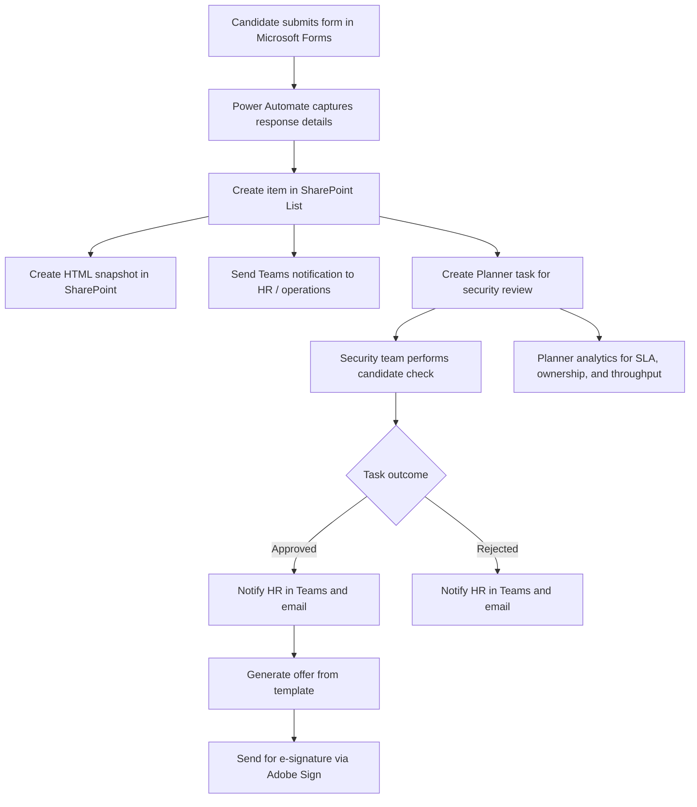

# HR Recruitment Automation Case Study

Sanitized case study of an end-to-end recruitment operations workflow built with Microsoft 365 and Adobe Sign.

## Overview

This repository presents a redacted automation project for candidate intake, background-check routing, HR coordination, offer generation, and e-signature delivery.

The original solution automated a multi-step hiring process:

- Candidate submits an application through Microsoft Forms
- Form response is written into SharePoint Lists for tracking
- A SharePoint-generated HTML file stores the submission snapshot
- Teams sends a notification about the new application
- Planner automatically creates a task for the security team
- HR and security collaborate through Planner task lifecycle updates
- Teams and email notify HR whether the candidate is approved or rejected
- Planner data is used for workload and SLA reporting
- HR generates an offer from a template with minimal manual input
- Adobe Sign sends the offer to the candidate for digital signature

## Business Problem

Recruitment and pre-employment checks often rely on fragmented manual handoffs between HR, security, and hiring stakeholders. This creates delays, inconsistent tracking, and poor visibility into case throughput.

The goal of this automation was to:

- Reduce manual coordination between HR and security
- Create a traceable candidate review history
- Standardize notifications and approval outcomes
- Minimize manual work during offer preparation
- Improve reporting on task ownership, completion time, and throughput

## Solution Summary

The solution used Power Automate with Microsoft 365 services and Adobe Sign to orchestrate the process from intake to signed offer.

Core services:

- Microsoft Forms
- SharePoint
- SharePoint Lists
- Microsoft Teams
- Microsoft Planner
- Outlook / email notifications
- Adobe Sign

## High-Level Workflow



## Repository Structure

```text
.
├── assets/
│   └── README.md
├── docs/
│   ├── architecture.md
│   ├── flow-breakdown.md
│   └── publishing-checklist.md
├── samples/
│   ├── mock-candidate-record.json
│   ├── mock-planner-task.md
│   └── offer-template-fields.json
└── README.md
```

## Technical Highlights

- Event-driven workflow based on Forms and SharePoint triggers
- Cross-service orchestration across Microsoft 365 tools
- Automated task assignment for security review
- Automated HR notifications based on task completion result
- Offer generation with minimal manual data entry
- Digital signature delivery via Adobe Sign
- Operational reporting using Planner task history and metrics

## Screenshots

Redacted screenshots can be placed in the `assets/` folder to illustrate the flow design and orchestration steps without exposing sensitive data.

Suggested screenshots:

- Candidate intake flow triggered by Microsoft Forms response
- SharePoint-based archival or list item creation step
- Planner task creation and task detail population
- Teams notification triggered by task completion

See [assets/README.md](./assets/README.md) for the recommended file names and usage.


## Privacy And Sanitization

This repository intentionally excludes:

- Real candidate data
- Company identifiers
- Internal URLs, tenant details, and email addresses
- Live flow exports and credentials
- Sensitive security decision logic

All descriptions, field names, and artifacts are generalized for portfolio use.

## Portfolio Value

This project demonstrates:

- Business process automation
- Power Platform solution design
- Microsoft 365 integration architecture
- Workflow orchestration across HR and security teams
- Reporting-oriented process design
- Practical document automation and e-signature integration

## Notes

This repository is a showcase artifact, not a deployable production package. It is intended to demonstrate architecture, flow design, and business impact without exposing confidential implementation details.
