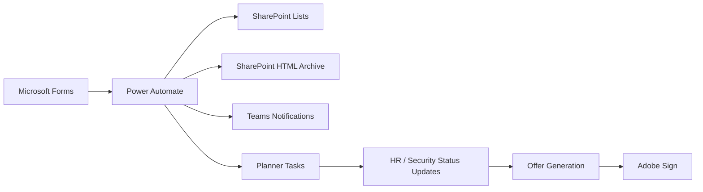

# Architecture

## Context

The solution was designed as a low-code recruitment operations pipeline that connected intake, security review, HR coordination, and offer processing.

## Systems

- `Microsoft Forms`: candidate application entry point
- `Power Automate`: orchestration engine for cross-service workflows
- `SharePoint Lists`: structured record of applications and processing history
- `SharePoint Document Library`: storage for generated HTML snapshots
- `Microsoft Teams`: operational notifications
- `Microsoft Planner`: security review task management
- `Outlook / Email`: formal approval or rejection notifications
- `Adobe Sign`: candidate offer signature workflow

## Architecture Pattern

The implementation followed an event-driven integration pattern:

1. A candidate submits an application form.
2. A flow reads full response details.
3. The submission is persisted as a structured SharePoint item.
4. A snapshot file is generated for archival or review convenience.
5. Notifications are sent to the relevant team.
6. A Planner task is created for security review.
7. Task status transitions drive downstream HR notifications.
8. Approved candidates continue into offer generation and digital signing.

## Design Considerations

- Centralized application history in SharePoint Lists
- Task-based collaboration between HR and security
- Simple notification model for operational visibility
- Minimal HR effort during offer generation
- Trackable activity for throughput and closure statistics

## Security And Compliance Boundaries

The public case study excludes any tenant-specific configuration and personal data. In a real deployment, the following areas require additional care:

- Access control to SharePoint lists and files
- Restricted visibility for candidate personal information
- Secure handling of approval outcomes
- Retention policy for application records
- E-signature document access and storage controls

## Suggested Visual For GitHub

Use a simplified architecture diagram such as:

## Reusability

This pattern can be adapted for:

- Employee onboarding approvals
- Vendor screening workflows
- Access request reviews
- Contract generation and approval pipelines
